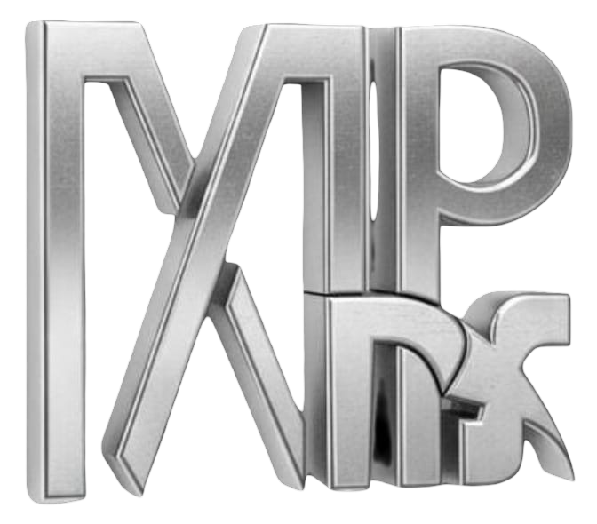

<div align="center">
  
  <h1>Marpx AI</h1>
  <p><strong>We don't just talk AI. We build it.</strong></p>
  <p>
    <a href="https://marpx.ai">Website</a> · 
    <a href="mailto:marpxstudio@gmail.com">Contact Us</a> · 
    <a href="https://x.com/MarpxAI">X (Twitter)</a> · 
    <a href="https://www.linkedin.com/in/murugayesu">LinkedIn</a> · 
    <a href="tel:+918072917432">+91 80729 17432</a>
  </p>
</div>

---

## Who We Are

**Marpx AI** is a premium AI agency helping businesses automate operations, deploy intelligent agents, and build custom AI systems — end to end.

We work with startups, SMEs, and enterprises across industries to identify the AI opportunities that will actually move the needle, then we build them, deploy them, and train your team to use them.

> *Stop paying to experiment. Start paying for results.*

---

## What We Do

We offer six core service pillars, covering every layer of AI adoption:

### ⚡ AI Automation Workflows
Put your repetitive tasks on autopilot — lead capture, CRM, email/SMS/WhatsApp automation, invoicing, document processing, social media scheduling, e-commerce automation, and automated reporting.

### ✨ General AI Services
AI-powered creation and communication — content writing, image & design generation, video production, voiceover & transcription, chatbots, document processing (OCR), SEO optimization, and translation.

### 🧠 AI Agents
Dedicated AI teammates that work autonomously — customer support agents, voice agents, sales agents, marketing agents, executive assistants, document processing agents, HR agents, and operations agents.

### 🔗 Autonomous & Multi-Agent Systems
Complete AI-powered business systems where multiple agents work together — customer support systems, sales pipeline systems, marketing operations, back-office automation, enterprise knowledge systems, and custom multi-agent architectures.

### ⚙️ Custom AI Development
Bespoke AI built for your exact needs — custom AI applications, fine-tuned models, AI integration with existing software, RAG/knowledge base development, AI backend & API development, AI SaaS products, private/on-premise deployment, and AI security & governance.

### 📚 AI Consulting & Training
Expert guidance on your AI journey — strategy consulting, AI readiness assessments, implementation roadmaps, team workshops & training, adoption consulting, ROI optimization, ongoing advisory, and maintenance & support.

---

## Our Process

```
01 Assess  →  Understand your workflows, identify the 5% worth building
02 Build   →  Move fast, build right, integrate seamlessly
03 Deploy  →  Train your team, monitor, refine until it runs without us
```

---

## Why Marpx AI

- **Results-obsessed** — we only build what's worth building
- **End-to-end delivery** — from strategy to deployment to training
- **No hand-off and vanish** — we stay until it sticks
- **Tool-agnostic** — we use what works best for your business
- **Non-tech friendly** — we make AI understandable at every step

---

## Get in Touch

Ready to build something real with AI?

| Channel | Details |
|---------|---------|
| 📧 Email | [marpxstudio@gmail.com](mailto:marpxstudio@gmail.com) |
| 📞 Phone | [+91 80729 17432](tel:+918072917432) |
| 🌐 Website | [marpx.ai](https://marpx.ai) |
| 🐦 X (Twitter) | [x.com/MarpxAI](https://x.com/MarpxAI) |
| 💼 LinkedIn | [linkedin.com/in/murugayesu](https://www.linkedin.com/in/murugayesu) |

---

<div align="center">
  <sub>© 2025 Marpx AI · Built with intelligence. Delivered with precision.</sub>
</div>
